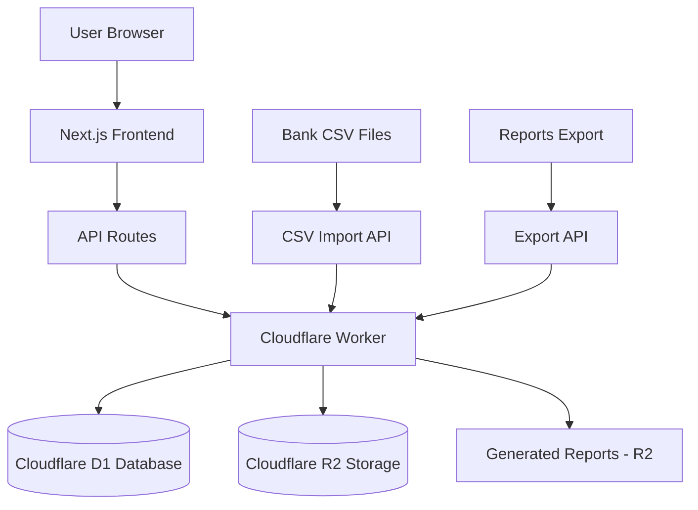

# BudgetWise Architecture

## Data Flow Diagram



## Core DB Schema (Cloudflare D1 - SQLite)

```prisma
model User {
  id        String   @id @default(uuid())
  email     String   @unique
  createdAt DateTime @default(now())
  budgets   Budget[]
  expenses  Expense[]
  goals     Goal[]
}

model Budget {
  id        String   @id @default(uuid())
  name      String   // e.g., "Monthly Groceries"
  amount    Float
  period    String   // "monthly", "weekly"
  userId    String
  user      User     @relation(fields: [userId], references: [id])
  expenses  Expense[]
}

model Expense {
  id          String   @id @default(uuid())
  amount      Float
  date        DateTime
  category    String   // e.g., "Dining", "Software"
  description String?
  budgetId    String?
  budget      Budget?  @relation(fields: [budgetId], references: [id])
  userId      String
  user        User     @relation(fields: [userId], references: [id])
}

model Goal {
  id         String   @id @default(uuid())
  name       String   // e.g., "Emergency Fund"
  target     Float    // $10,000
  current    Float    // $2,500
  targetDate DateTime?
  type       String   // "emergency", "retirement", "vacation", "college", "investment"
  userId     String
  user       User     @relation(fields: [userId], references: [id])
}
```

## Cloudflare R2 Storage Structure

R2 stores:
- Uploaded CSVs (key: user/{userId}/uploads/{filename})
- Exported reports (key: user/{userId}/exports/{reportId}.pdf)